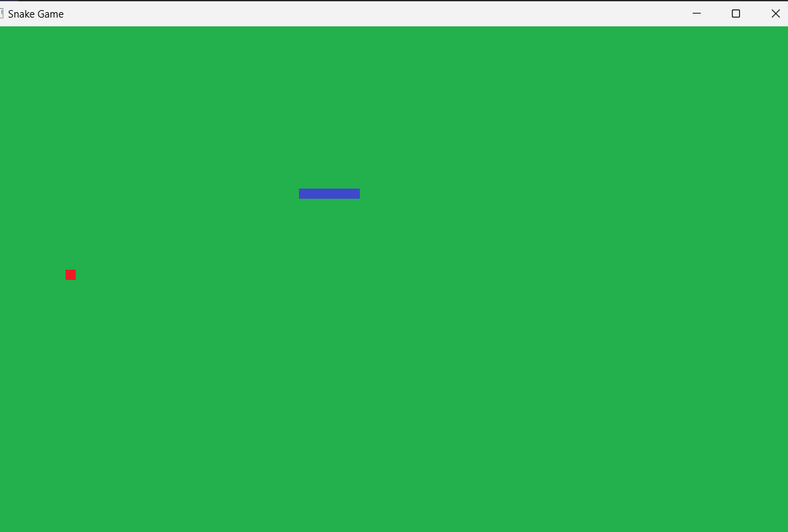
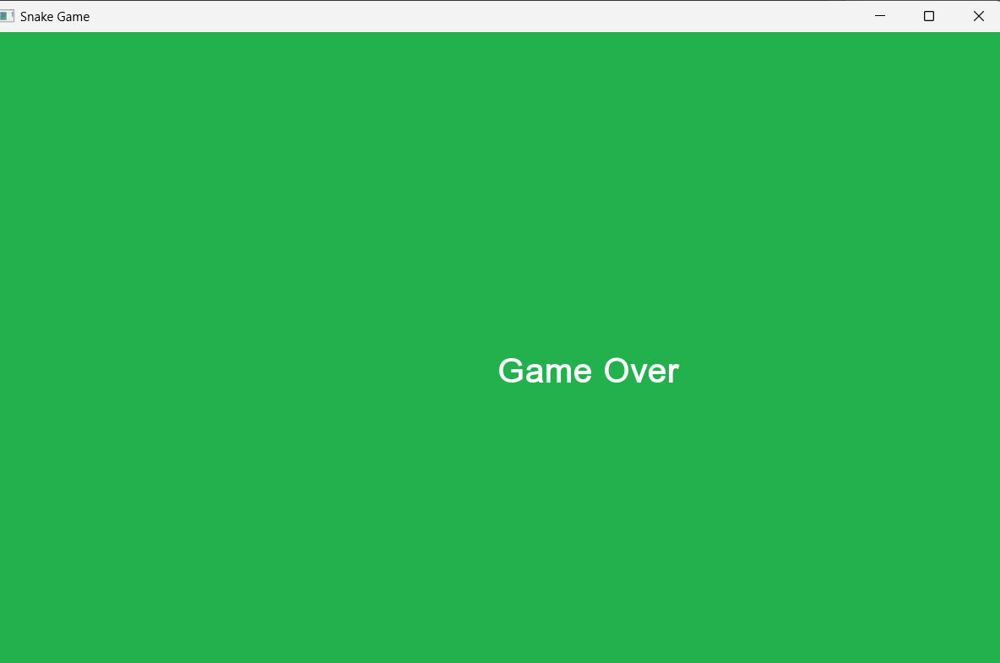

# Snake Game in SFML

## Overview
This repository contains a classic Snake game implemented in C++ using the SFML (Simple and Fast Multimedia Library). The game showcases fundamental game development concepts such as game loops, event handling, and rendering.

## Features
- **Classic Snake Gameplay**: Control the snake to eat food and grow longer.
- **Smooth Graphics**: Utilizes SFML for rendering graphics.
- **Responsive Controls**: Real-time keyboard input handling.

## Getting Started

### Prerequisites
- **C++ Compiler**: Ensure you have a C++ compiler installed (e.g., GCC, Clang, MSVC).
  https://sourceforge.net/projects/gcc-win64/
- **SFML Library**: Download and install the SFML library from SFML's official website.
https://www.sfml-dev.org/download/sfml/2.6.1/

## How to Play
- Objective: Guide the snake to eat food and grow longer.
- Controls: Use the arrow keys to change the direction of the snake.
- Game Over: The game ends if the snake collides with itself or the walls.

## Contributing
Contributions are welcome! If you have any improvements or bug fixes, feel free to open a pull request

## Acknowledgments
- SFML: Thanks to the SFML team for providing an excellent multimedia library.
- Inspiration: Inspired by the classic Snake game. 

## Contact
For any questions or feedback, feel free to reach out to me at kabileshwaran1896@gmail.com
